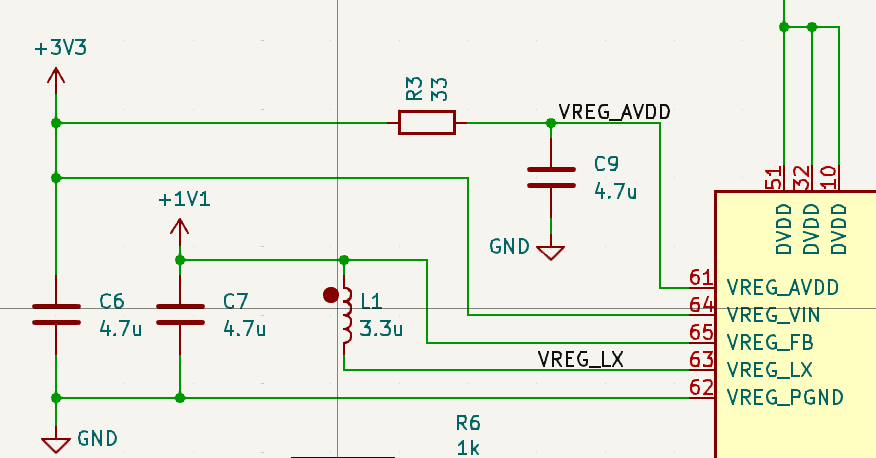
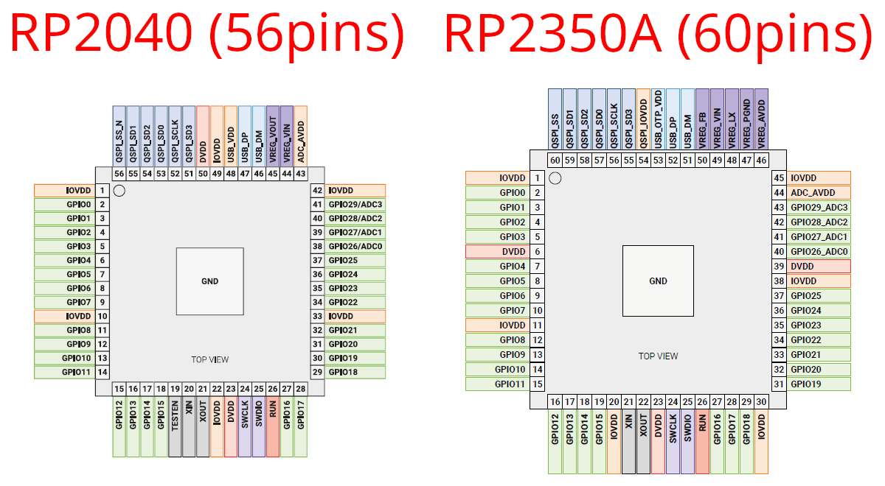
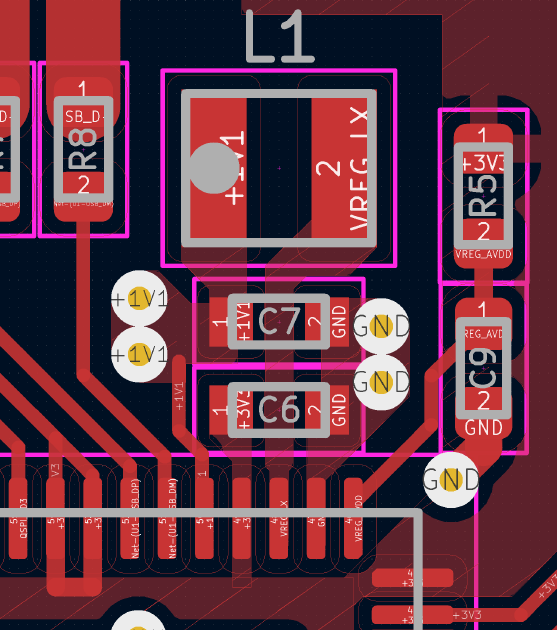

# RP2350 の調査

突如発表された RaspberryPi Pico 2 とそのMCUである RP2350 について。

<https://www.raspberrypi.com/products/rp2350/>

ドキュメント類:

* [データシート](https://datasheets.raspberrypi.com/rp2350/rp2350-datasheet.pdf)
* [ハードウェアデザインガイド](https://datasheets.raspberrypi.com/rp2350/hardware-design-with-rp2350.pdf)
* [プロダクト概要](https://datasheets.raspberrypi.com/rp2350/rp2350-product-brief.pdf)
* <https://www.raspberrypi.com/documentation/microcontrollers/silicon.html#rp2350>

RISC-V コアはオープンソースなハードウェア [Wren6991/Hazard3](https://github.com/Wren6991/Hazard3)。

> Our boot ROM can even auto-detect the architecture for which a second-stage binary has been built and reboot the chip into the appropriate mode.

[引用元](https://www.raspberrypi.com/documentation/microcontrollers/silicon.html#architecture-switching:~:text=Our%20boot%20ROM,appropriate%20mode)

焼かれているファームウェアからビルド時のアーキテクチャをブートロムで判断して、RISC-Vコアに切り替えるらしい。
RISC-Vコアにはセキュリティ機能と倍精度浮動小数点のアクセラレータが無い。

パッケージは4種類。GPIOが従来通りの30本か48本かの違い(A/B)と、チップ内に2MB Flashが内蔵されているかどうかの違い(50/54)。

名前の意味は以下の通り

* `RP` = Raspberry Pi
* `2` = Number of cores
* `3` = Type of core (e.g. Cortex-M33)
* `5` = `floor(log2(RAM / 16KB))`: 5 = 32x16KB = 512KB+
* `0` = `floor(log2(nonvolatile / 128KB))`: 4 = 16x128KB = 2MB+

セキュリティ機能の抜粋

* Signed boot support
* 8KB of on-chip antifuse one-time-programmable (OTP) memory: 鍵の保存用?
* SHA-256 acceleration
* A hardware true random number generator (TRNG)

[RP2350B のブレイクアウトボードのデザインファイル](https://datasheets.raspberrypi.com/pico/RPi-Pico-2-PUBLIC-20240708.zip)

VREG回りの新規回路

[USB PIDについて](https://www.raspberrypi.com/documentation/microcontrollers/silicon.html#usb-pids)

* 難しいことしないならRP2350の標準のVID=0x2E8AとPID? をセットし iManufacturer, iProduct, iSerial を指定する
* 独自ドライバが必要ならユニークなPIDが要るだろうね
* <https://github.com/raspberrypi/usb-pid> でPIDは管理されてる

## from Product brief

<https://datasheets.raspberrypi.com/rp2350/rp2350-product-brief.pdf>

RP2040とのピンアウトの比較

* 56 -> 60 pins に増えている
    * DVDD が左右に2か所増えた
    * 下方のTESTEN がなくなった
    * 下方にGPIO18が移動しIOVDDが増えた
    * ADC\_AVDD が右へ移動した
    * 上方のVREG関連が2本から+3して5本に
    * 上方から DVDD と IOVDD が減った
    * 上方にて QSPI\_IOVDD が増えた
        > Provides the IO supply for the chip’s QSPI interface
    * 上方にて USB\_VDD が USB\_OTP\_VDD に変わった
        > Power supply for internal USB full-speed PHY and OTP, nominal voltage 3.3 V

## from Hardware design guide

### +1.1V 内蔵レギュレーター

リファレンスボードのデザインの説明だが、自分でボードを設計する際の参考になる。

<https://datasheets.raspberrypi.com/rp2350/hardware-design-with-rp2350.pdf>

オンチップの+1.1V用レギュレーターが、その消費電力特性に合わせてリニアレギュレーターからスイッチングレギュレーターに変わった。
最大200mAまで引けるようになってる。

スイッチングなので、コイル(インダクタ)とコンデンサ(キャパシタ)により安定した直流にし、出力電圧のフィードバックを受けて狙った電圧に(比率を)調整する。

電源周りの回路はかなりタイトなので、リファレンスレイアウトから変える余地は少なそう。
インダクタの巻き向きにすらセンシティブ。
水晶と併せて部品型番すら指定したものでないと正常に動作しないかも(代える場合は自己責任)。

極性を示す0806(2016)のインダクタ 3.3uH を特注した。
これは一般向けに間もなく提供される。

電源周りに使用する部品のまとめは以下の通り。

* C6, C7 & C9 - 4.7μF (0402, 1005 metric)
* L1 - Abracon TBD (0806, 2016 metric)
* R3 - 33Ω (0402, 1005 metric)

5Vから3.3Vへの降圧はRP2040と同じで良い。
型番はNCP1117

レギュレーターから遠い場所(反対側)にあるデカップリングコンデンサは 100nF ではなく 4.7uF を推奨

### Flash

FlashはRP2040とほぼ一緒。例外は RP2354 シリーズでFlash内蔵の場合。
回路を省略するか、部品を未実装にすれば良い。

2つ目のFlashを積める。制御には場所が近いGPIO0が適している。

ブート時のFlashの読み取りには 03h シリアル読み取りが 1MHz で行われる。
ブートロムによるFlashプログラミング(例のUSBドライブモード)をサポートするには、Flash側に追加で以下のコマンドのサポートが必要。

* 02h 256-byte page program
* 05h status register read
* 06h set write enable latch
* 20h 4kB sector erase

Winbond W25Qシリーズを使ってればだいたい良いんじゃないかな?

FlashのXIPモードに注意。XIPモードではシリアルコマンドに応答しなくなるので、
RP2350がブートで使ってるシリアル読み取りができなくなる。
この状態はFlashデバイスの電源入れ直しが必要になる。
以下の固定コマンドでリセットを試みる。これはだいたい機能するが、機能しないこともある。

* CSn=1, IO[3:0]=4’b0000 (via pull downs to avoid contention), issue ×32 clocks
* CSn=0, IO[3:0]=4’b1111 (via pull ups to avoid contention), issue ×32 clocks
* CSn=1
* CSn=0, MOSI=1’b1 (driven low-Z, all other I/Os Hi-Z), issue ×16 clocks

### 水晶発振

外部クロックソースはなくても動くけど、安定のためにはあった方が良い。
クロックソースはXINに入れるCMOSか、XINとXOUTに12MHzの水晶発振子。

水晶発振子には ABM8-272-T3 を推奨。

* 周波数許容範囲 ±30ppm
* ESR 50Ω

    1KΩ と併せて +3.3V 駆動時の電流量を抑制する目的で設定されている。

        3.3V / 1050 Ω ≒ 0.00314... = 3mA

* 負荷容量 10pF

    サンプルではコンデンサ 15pF x2を繋いでる。
    水晶発振子からみて直列接続なので 7.5pF になる(計算式は省略)。
    回路自身の寄生容量を 3pF と仮定してメーカー推奨の 10pF に近い値にした。
    寄生容量を抑えるためトレースは短くした方が良い。

推奨は ABM8-272-T3 推奨 (大事なことなので2回…)

自分が以前RP2040のブレイクアウトボード作った時は [FA238V](https://www.epsondevice.com/crystal/ja/products/crystal-unit/fa238v.html) の 12MHz を使った。([販売店リンク](https://akizukidenshi.com/catalog/g/g105225/))。
特性は以下の通りなので周波数許容差的にちょっと足りない可能性がある。
あとESRがちょっと大きいけど、1KBと足せば 0.0029... でほぼ3mAか。

* 周波数許容差: ±50ppm
* 周波数温度特性: ±30ppm
* 負荷容量: 10pF
* 直列抵抗(ESR?): 100Ω

ABM8-272-T3は以下の DigiKey か Mouser での入手が容易か。

* <https://www.digikey.jp/ja/products/detail/abracon-llc/ABM8-272-T3/22472366>
* <https://www.mouser.jp/ProductDetail/ABRACON/ABM8-272-T3?qs=QpmGXVUTftEj6miOiJBMxQ%3D%3D>

秋月電子で買える、代替品になりそうなもの

* スルーホールの水晶発振子: <https://akizukidenshi.com/catalog/g/g108669/>
* 表面実装の水晶発振子: <https://akizukidenshi.com/catalog/g/g117134/>
* MEMS発振子: <https://akizukidenshi.com/catalog/g/g111093/>

    XINだけで行けるってことだろうけど、経年劣化を考えるとちょっと不安かな?

### I/O

USB D+/-には27Ωの抵抗が要る。RP2040と同じ。
USBを12Mbpsで動かすにはインピーダンスを90Ω近辺にする必要がある。
1mm厚のPCBで0.8mm幅のトラック0.15mmのギャップで、裏がベタGNDで約90Ωになる。
このパラメーターを変える場合、ちゃんと設計するか祈るからしい。
いずれにせよUSB FSは動くかもしれないが、USB標準に準拠することはない。

## from Datasheet

コアにAHB5があり、AHB5からAPBに繋がってる。
(2.1. Bus Fabric)

AHB5とAPBはARMが定めるバス規格

* AHB5 = Advanced High-Performance Bus 5
* APB = Advanced Peripheral Bus

SIO (Single-cycle IO subsystem) がセキュアと非セキュアで二重化されてる。
(3.1.1. Secure and Non-secure SIO)

RP2350ではCortex-M33 に幾つかのコプロセッサ(拡張)が追加されている。
コプロセッサは1サイクルごとに64ビットを転送できる、
プロセッサに密結合されたモジュールのこと。
(3.6. Cortex-M33 Coprocessors)

* GPIOコプロセッサ(GPIOC) GPIOの高速な読み書きができる
* DCP 倍精度浮動小数点演算 (Cのdouble)
* RCP 冗長コプロセッサ - セキュリティのためのもの
* FPU 浮動小数点ユニット (Cのfloat)

Core 0 をARM、Core 1 をRISC-Vのような混合アーキテクチャも、可能ではある。
(3.9.2. Mixed Archtecture Combinations)

ブートROMが使う専用のブートRAMがある。
通常のRAMより遅く、またブートRAMからの命令実行はできない。

8KBの一度だけ書き込み可能なストレージがある。
ストレージは初期値で0で、1度だけ1に変更できる。
(16ビット+8ビット) x 4096 の合計8KBになる。
データは16ビット、パリティに8ビット。
デバッグ無効化などの幾つかの重要なフラグがそこに含まれる。
(4.5. OTP)

UARTでプログラムを流し込む方法が増えてる。
QSPIが新たなUARTの口になってそこでブートシェルが動くらしい。
(5.8. UART Boot)

(感想)
セキュアモードやOTPによるハックの禁止など、ガチで量産最終製品への組み込みを目指した感じ。
一方でVREG回りの回路の難しさを考えると、そんなんでええのか? ってなる。
